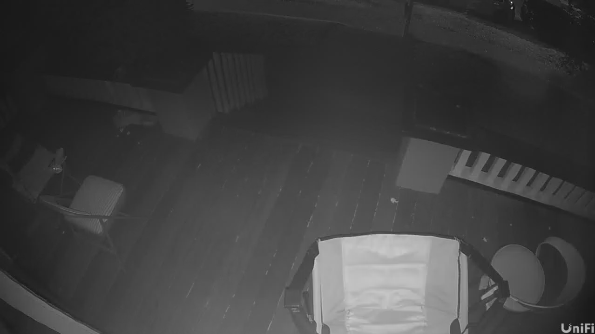

RTSP Fullscreen Viewer (OpenCV) — Dual-Stream

A tiny Python script that opens one or TWO RTSP/RTSPS video streams in a single **fullscreen** window using OpenCV. 
Each stream reconnects automatically if it drops, and you can **quit** with `q` or `Esc`. 
The viewer uses a custom black canvas for letterboxing so there are no white gutters in fullscreen.

## Camera View


## What’s new
- **Two concurrent streams** shown **side-by-side** in one window.
- **Independent reconnect** per stream with the same `RETRY_SECONDS` backoff.
- **Background reader threads** for smooth playback while the UI stays responsive.
- **Black letterbox background** (our own canvas) so fullscreen margins aren’t white.
- **Status overlays** on each tile (e.g., `LIVE`, `FROZEN`, `connecting...`).
- **ASCII-safe labels**: overlays use `-` instead of the Unicode em dash `—` to avoid `???` with OpenCV’s built-in fonts.
  - If you want Unicode text, use `opencv-contrib-python` with FreeType or render with PIL.

## Features
- Prefers the **FFmpeg** backend (`cv2.CAP_FFMPEG`) when available for robust RTSP handling.
- Fullscreen display via OpenCV HighGUI.
- Automatic reconnect with a configurable delay (`RETRY_SECONDS`, default 60s).
- Graceful exit with `q` or `Esc`.

## Requirements
- **Python** 3.9+
- **NumPy** (for the mosaic/canvas)
- **OpenCV** (e.g., `opencv-python`)
- OS GUI support for OpenCV windows (e.g., X11 on Linux, Quartz on macOS, Win32 on Windows)
- (Recommended) **FFmpeg** installed on your system for broader codec/RTSP support
- (Optional) **opencv-contrib-python** if you want TrueType font rendering (Unicode) via FreeType

## Install
```bash
# optional but recommended: create a virtual environment
python -m venv .venv
# macOS/Linux
source .venv/bin/activate
# Windows (PowerShell)
.venv\Scripts\Activate.ps1

# install python deps (choose one)
# 1) from requirements.txt
pip install -r requirements.txt
# 2) or directly
pip install opencv-python numpy

# optional: for Unicode TrueType fonts via FreeType
pip install opencv-contrib-python
```
 
## Configure
In the script, set:
- `rtsp_url_1` / `rtsp_url_2` – your two RTSP/RTSPS URLs
- `name_left` / `name_right` – overlay titles for each camera
- `RETRY_SECONDS` – reconnect delay (default 60s)
- `TARGET_HEIGHT` – per-tile height before mosaicking (bigger = larger tiles)

## Run
```bash
python your_script.py
```

## Controls
- `q` or `Esc` – quit
- (Optional) To make the window resizable instead of fullscreen, remove the line that sets `WND_PROP_FULLSCREEN` in the script.

## Notes
- The viewer uses `getWindowImageRect` (OpenCV 4+) to detect the true fullscreen size once the window is visible, then draws onto a black canvas of that exact size. 
  If your build lacks this API, the code falls back to a sane default size for the canvas; the background remains black either way.
- Overlays intentionally use ASCII `-`. If your editor auto-substitutes an em dash `—`, you may see `???` on screen—switch back to `-` or install `opencv-contrib-python`/FreeType.

## Troubleshooting
- **White gutters / margins**: The script now renders onto a black canvas the size of the fullscreen window; this removes white gutters. If you still see white, ensure your OpenCV is 4.x and NumPy is installed.
- **Choppy playback**: Lower `TARGET_HEIGHT` to reduce per-frame resize cost; ensure network stability and that FFmpeg is available.
- **No video / intermittent**: Check credentials/URL, camera profile, and that your OpenCV build includes FFmpeg. The script will log and retry automatically.